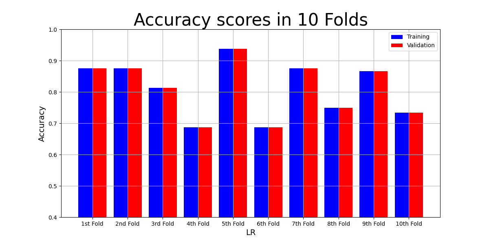

<!-- Template from https://github.com/othneildrew/Best-README-Template -->
<a name="readme-top"></a>

<!-- PROJECT LOGO -->
<br />
<div align="center">
  <a href="https://github.com/teco-kit">
    
  </a>

<h3 align="center">Predicting Dementia Based on Speech Using GPT-3 Text Embeddings.</h3>

  <p align="center">
    Dementia is the loss of cognitive function, which affects how a person can use language and communicate.
    Early detection and intervention are crucial for improving the quality of life for affected individuals. 
    This project aims to harness the power of natural language processing and deep learning to diagnose dementia at an
    early stage based on speech patterns. 
    By utilizing GPT-3 text embeddings, we seek to develop an innovative tool that can assist in the early 
    detection of dementia.
    <br />
    <a href="https://github.com/probstlukas/gpt3-dementia-detection"><strong>Explore the docs »</strong></a>
    <br />
    <br />
    <a href="https://github.com/probstlukas/gpt3-dementia-detection/issues">Report Bug</a>
    ·
    <a href="https://github.com/probstlukas/gpt3-dementia-detection/issues">Request Feature</a>
  </p>
</div>


<!-- TABLE OF CONTENTS -->
<details>
  <summary>Table of Contents</summary>
  <ol>
    <li>
      <a href="#about-the-project">About The Project</a>
      <ul>
        <li><a href="#built-with">Built With</a></li>
      </ul>
    </li>
    <li>
      <a href="#getting-started">Getting Started</a>
      <ul>
        <li><a href="#prerequisites">Prerequisites</a></li>
        <li><a href="#installation">Installation</a></li>
      </ul>
    </li>
    <li>
      <a href="#usage">Usage</a>
      <ul>
        <li><a href="#config">Config</a></li>
        <li><a href="#transcription">Transcription</a></li>
        <li><a href="#embedding">Embedding</a></li>
        <li><a href="#classification">Classification</a></li>
      </ul>
    </li>
    <li><a href="#results">Results</a></li>
    <li><a href="#license">License</a></li>
    <li><a href="#acknowledgments">Acknowledgments</a></li>
  </ol>
</details>


<!-- ABOUT THE PROJECT -->
## About The Project

This project was created during my position as a research assistant at TECO research group at Karlsruhe Institute of Technology (KIT).
It involves several steps: 
* Transcription using [Whisper](https://openai.com/research/whisper) 
* Creation of [GPT-3 text embeddings](https://platform.openai.com/docs/guides/embeddings) to leverage contextual depth from the transcribed text
* Training machine learning models using the extracted features
* Prediction on test data

### Built With

[![Python][Python]][Python-url]

<p align="right">(<a href="#readme-top">back to top</a>)</p>


<!-- GETTING STARTED -->
## Getting Started

To get a local copy up and running follow these steps.

### Prerequisites

To gain access to the data used in this project, you must first join as a [DementiaBank member](https://dementia.talkbank.org/index.html).

For simplicity, we used the dataset provided for the [ADReSSo-challenge](https://dementia.talkbank.org/ADReSS-2021/) which has been balanced with respect to age and gender in order to eliminate potential confunding and bias.

In our case, the downloaded ADReSSo audio files had an incompatible format to transcribe them with Whisper. 
Therefore, we first had to format them with ffmepg. 
Since we cannot reformat and replace the files at the same time, we have to save them temporarily and then replace the old files:
```sh
find . -name '*.wav' -exec sh -c 'mkdir -p fix && ffmpeg -i "$0" "fix/$(basename "$0")"' {} \;
```
Now replace the original audio files with the formatted files in the `fix` folder, which can then be deleted.

### Installation

1. Get an OpenAI API Key at [https://platform.openai.com/account/api-keys](https://platform.openai.com/account/api-keys).
2. Set an environment variable 'OPENAI\_API\_KEY' (replace ~/.zshrc with ~/.bashrc if you use Bash):
    ```sh
    echo "export OPENAI\_API\_KEY='your key'" | cat >> ~/.zshrc
    ```
1. Clone the repo
   ```sh
   git clone https://github.com/probstlukas/gpt3-dementia-detection.git
   ```
2. Install required Python packages
   ```sh
   pip install -r requirements.txt
   ```

<p align="right">(<a href="#readme-top">back to top</a>)</p>


<!-- USAGE EXAMPLES -->
## Usage

### Config
Before running the program, make sure that the default settings (logging level, embedding engine, directory paths, ...) in `config.py` suit you. 
Then start the program by running `main.py`.

### Transcription


If the data has not yet been transcribed, confirm with `yes`, select your preferred Whisper model and wait until the transcription process is complete.

### Embedding

 
The embeddings are created separately for training and test data. `train_embeddings.csv` also contains the MMSE score and the diagnosis label for each audio file.
#### Remark 
It is not necessary to scale the embeddings before using them. They are already normalized and are in the vector space with a certain distribution.

### Classification


In this step, machine learning models are trained and evaluated using the provided embeddings.
For comparison with other, more complex classifiers, we create a dummy classifier that makes predictions that ignore the input features.
This gives us a baseline performance (like flipping a coin, i.e. about 50%).  

We use three different models: Support Vector Machine, Logistic Regression, and Random Forest.

The classification process can be divided into two parts:

#### Model checking
* Perform K-fold cross-validation on the training set: split it into K equal partitions, where each partition is divided into training and validation set.
* Hyperparameter optimization
* Record model performance (accuracy, precision, recall, f1-score)
* Visualize results: one plot for each metric per model, resulting in a total of 12 plots. For example, this plot relates to the accuracy metric for the logistic regression model: 



#### Model building
* Train each model on the entire training set with the best hyperparameters.
* Predict labels on the test data using the trained model.
* Evaluate performance by comparing the results to real medical diagnoses.
* Record trained model sizes.

All processed data and results are stored in the configured directories specified in `config.py`.

<p align="right">(<a href="#readme-top">back to top</a>)</p>


<!-- RESULTS -->
## Results
These results were obtained with the following configuration:
* Whisper model: `base`
* Embedding engine: `text-embedding-ada-002`
* Number of splits for the K-Fold CV: `K=10`

|Model|Size |
|-----|-----|
|SVC  |1441162 B|
|LR   |13007 B|
|RF   |82947 B|
|Total|1537116 B|

|Set|Model| Accuracy      |Precision   |Recall       |F1           |
|---|-----|---------------|------------|-------------|-------------|
|Train|SVC  | 0.779 (0.084) |0.839 (0.048)|0.779 (0.084)|0.772 (0.084)|
|Train|LR   | 0.81 (0.085)  |0.847 (0.07)|0.81 (0.085) |0.8 (0.091)  |
|Train|RF   | 0.804 (0.052) |0.839 (0.044)|0.804 (0.052)|0.793 (0.053)|
|Test|SVC  | 0.779         |0.839       |0.779        |0.772        |
|Test|LR   | 0.81          |0.847       |0.81         |0.8          |
|Test|RF   | 0.804         |0.839       |0.804        |0.793        |
|Test|Dummy| 0.425         |            |             |             |


Our results show that GPT-3 text embeddings can be used to reliably distinguish individuals with Alzheimer's disease 
from healthy individuals from the control group, just by analyzing their speech behavior.

<!-- LICENSE -->
## License

Distributed under the MIT License. See `LICENSE.txt` for more information.

<p align="right">(<a href="#readme-top">back to top</a>)</p>


<!-- ACKNOWLEDGMENTS -->
## Acknowledgments

* [DementiaBank](https://dementia.talkbank.org/)
* [ADReSSo-Challenge](https://dementia.talkbank.org/ADReSS-2021/)
* ["Predicting dementia from spontaneous speech using large language models" by Felix Agbavor and Hualou Liang from Drexel University](https://journals.plos.org/digitalhealth/article?id=10.1371/journal.pdig.0000168)

<p align="right">(<a href="#readme-top">back to top</a>)</p>


<!-- MARKDOWN LINKS & IMAGES -->
<!-- https://www.markdownguide.org/basic-syntax/#reference-style-links -->
[Python]: https://img.shields.io/badge/Python-3776AB?style=for-the-badge&logo=python&logoColor=white
[Python-url]: https://python.org 
